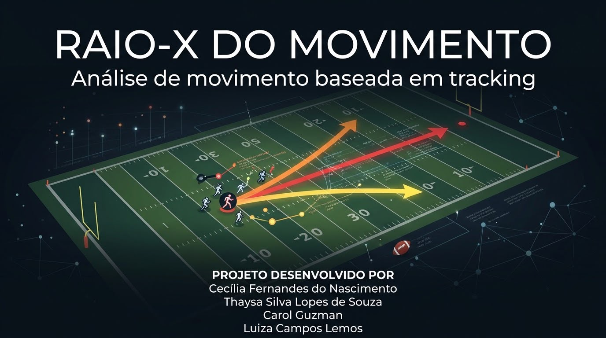

# RAIO-X DO MOVIMENTO

> Veja para onde a jogada pode seguir.

Ferramenta visual **preditiva** para analisar uma jogada de passe da NFL. Ela
mostra o campo animado quadro a quadro, exibe métricas de cobertura e adiciona
uma camada que estima, a partir de dados históricos reais de tracking, para
onde cada jogador tende a se mover em seguida.

Feita como protótipo de hackathon (NFL Big Data Bowl), em **HTML + CSS +
JavaScript puro** — sem frameworks, sem build e sem nenhuma biblioteca externa.
Toda a interface é **em português**.

> 🛠️ **Desenvolvido com o [Kiro](https://kiro.dev).** Este projeto foi criado
> usando o Kiro como IDE de desenvolvimento assistido por IA, conforme a
> proposta do hackathon. Veja a seção [Desenvolvido com o Kiro](#desenvolvido-com-o-kiro).

---

## Índice

- [Em resumo](#em-resumo)
- [Para que serve](#para-que-serve)
- [Como abrir](#como-abrir)
- [Como usar](#como-usar)
- [Como funciona por dentro](#como-funciona-por-dentro)
  - [O campo e a animação](#o-campo-e-a-animação)
  - [Fases da jogada](#fases-da-jogada)
  - [Métricas de cobertura](#métricas-de-cobertura)
  - [Coverage Reveal Score (CRS)](#coverage-reveal-score-crs)
  - [Camada preditiva (Movement Probability)](#camada-preditiva-movement-probability)
  - [Orientação ao Técnico](#orientação-ao-técnico)
- [Desenvolvido com o Kiro](#desenvolvido-com-o-kiro)
- [Estrutura dos arquivos](#estrutura-dos-arquivos)
- [De onde vêm os dados](#de-onde-vêm-os-dados)
- [Limitações desta versão](#limitações-desta-versão)
- [Próximos passos](#próximos-passos)
- [Aviso importante](#aviso-importante)

---

## Em resumo

O Raio-X do Movimento pega os dados brutos de rastreamento de uma jogada de
passe (posição, velocidade, aceleração e direção de cada jogador, 10 vezes por
segundo) e transforma isso em uma leitura rápida e visual da jogada. Além de
rever o que aconteceu, ele **estima o que tende a acontecer em seguida** com
base em padrões observados em jogadas semelhantes do histórico.

A jogada de exemplo já vem carregada: **Tampa Bay vs Dallas**, semana 1 da
temporada 2021 — Tom Brady tenta um passe profundo para Chris Godwin, que fica
incompleto (`gameId 2021090900`, `playId 97`).

---

## Para que serve

O objetivo é apoiar a decisão de técnicos, olheiros e analistas durante a
análise de uma jogada. Em vez de só reassistir o lance, a ferramenta ajuda a:

- **Visualizar** a jogada no campo, do pré-snap ao pós-lançamento;
- **Estimar** para onde um jogador tende a se mover, com até três trajetórias
  possíveis e suas probabilidades;
- **Orientar** com uma sugestão curta e acionável baseada nesses padrões.

A ideia é encurtar o caminho **tracking → movimento → previsão → decisão**.

---

## Como abrir

Abra o arquivo `index.html` no navegador (Chrome, Edge ou Firefox).

Não precisa de servidor, nem de Python ou Node: todos os dados já estão
embutidos em arquivos `.js` e são carregados junto com a página.

---

## Como usar

1. A jogada de exemplo já vem carregada (TB vs DAL — Brady incompleto para Godwin).
2. Use os botões **Reproduzir / Pausar / Reiniciar** e o **slider** para
   percorrer os frames.
3. **Clique em qualquer jogador** no campo para ver a previsão de movimento dele
   no painel lateral.
4. As setas de previsão aparecem **somente antes do lançamento** — depois do
   release não faz sentido prever, porque o movimento já aconteceu.
5. O checkbox no topo liga e desliga as setas de previsão.

---

## Como funciona por dentro

Toda a lógica de tela e cálculo fica em `app.js`. Nada é inventado ali: os
valores vêm de `play_data.js` (a jogada) e `predictions.js` (os padrões
históricos), ambos gerados a partir dos CSVs reais do dataset.

### O campo e a animação

O campo é desenhado num `<canvas>` usando as coordenadas padrão do NFL Big Data
Bowl (x de 0 a 120 jardas, incluindo as duas end zones; y de 0 a 53,3). As
posições reais de cada jogador e da bola são convertidas de jardas para pixels
e redesenhadas quadro a quadro, a cerca de 10 frames por segundo (o mesmo ritmo
do rastreamento original). Os jogadores são coloridos por função: ataque, em
rota, defesa, cobertura e a bola.

### Fases da jogada

A ferramenta lê os eventos reais do tracking (como `ball_snap` e `pass_forward`)
para dividir a jogada em quatro fases: **PRÉ-SNAP**, **SNAP**, **LANÇAMENTO** e
**PÓS-LANÇAMENTO**. A fase atual aparece no banner do campo e nos indicadores
abaixo dos controles.

### Métricas de cobertura

Abaixo do campo ficam três métricas discretas:

- **Cobertura** — o esquema de cobertura da jogada (ex.: Cover-1).
- **Separação** — a distância, em jardas, entre o receptor em foco e o defensor
  mais próximo, atualizada a cada frame.
- **Coverage Reveal Score** — descrito abaixo.

O "par em foco" (receptor ↔ defensor) é escolhido pela menor separação no
momento do snap. É um proxy simples e transparente, já que o dataset não marca
explicitamente quem cobre quem.

### Coverage Reveal Score (CRS)

Índice derivado de 0 a 100 que mede o quanto a defesa "se revelou" entre o snap
e o lançamento. Ele combina três sinais reais, medidos nesse intervalo:

1. Quanto os defensores mudaram de **direção** (a defesa girou);
2. Quanto mudaram de **velocidade** (a defesa reagiu);
3. Quanto a **separação** do par em foco mudou (a jogada abriu).

Cada sinal é normalizado por um teto simples e combinado com pesos iguais. Na
jogada de exemplo o CRS fica em torno de 59/100. É uma métrica derivada, **não é
uma estatística oficial da NFL**.

### Camada preditiva (Movement Probability)

Para o jogador selecionado, a ferramenta mostra até **3 movimentos futuros
estimados**, representados por setas no campo:

- 🔴 **Vermelha** — movimento mais provável
- 🟠 **Laranja** — segunda possibilidade
- 🟡 **Amarela** — terceira possibilidade

Cada seta tem direção, trajetória e uma **probabilidade normalizada** (as três
somam 100%).

**Como as probabilidades são calculadas (sem machine learning):**

1. Para uma amostra de jogos, identifica-se o `ball_snap` de cada jogada.
2. Para cada jogador, mede-se o vetor de deslocamento do snap até cerca de 1
   segundo depois (10 frames), usando as posições reais.
3. Cada vetor é orientado pela direção da jogada, para que "para frente do
   ataque" seja sempre o mesmo sentido (jogadas para a esquerda são espelhadas).
4. Os vetores são agrupados por **função do jogador + lado em que ele se
   alinhou**, comparando cada jogador com outros historicamente semelhantes.
5. Os deslocamentos são agrupados por direção; os três padrões mais frequentes
   viram as três setas, e a **probabilidade de cada uma é a frequência
   observada** daquele padrão.

Se um jogador tiver **menos de 8 exemplos** históricos, a ferramenta mostra
"dados históricos insuficientes" em vez de arriscar uma estimativa.

### Orientação ao Técnico

Um texto curto gerado apenas a partir do padrão observado: informa a reação mais
provável (com a porcentagem) e sugere explorar o espaço oposto. Quando o padrão
principal é fraco (abaixo de 40%) ou a amostra é pequena, a ferramenta assume
isso e mostra que a evidência histórica é insuficiente para uma sugestão
confiável.

---

## Desenvolvido com o Kiro

Este projeto foi construído usando o **[Kiro](https://kiro.dev)**, um ambiente
de desenvolvimento com IA, o que era a proposta central do hackathon: criar uma
aplicação apoiando-se no Kiro durante todo o processo.

O Kiro foi usado como parceiro de desenvolvimento para:

- **Explorar e entender os dados** do NFL Big Data Bowl (CSVs de tracking,
  jogadas, jogos e scouting) antes de decidir o que construir;
- **Estruturar a aplicação** em HTML, CSS e JavaScript puro, sem frameworks;
- **Implementar a lógica** de renderização do campo, animação, métricas de
  cobertura, Coverage Reveal Score e a camada preditiva de movimento;
- **Processar os dados brutos** para gerar os arquivos embutidos
  (`play_data.js` e `predictions.js`);
- **Escrever e revisar** a documentação do projeto.

O fluxo de trabalho combinou a análise dos dados reais com a assistência do
Kiro para transformar rastreamento bruto em uma ferramenta visual e preditiva.

---

## Estrutura dos arquivos

| Arquivo | O que é |
|---|---|
| `index.html` | Estrutura da página (cabeçalho, campo, controles e painel lateral) |
| `styles.css` | Aparência: tema escuro, layout responsivo em grid |
| `app.js` | Núcleo: desenho do campo, animação, métricas e camada preditiva |
| `play_data.js` | **Dados reais** da jogada atual (jogadores, posições e eventos) |
| `predictions.js` | **Padrões de movimento históricos** pré-computados dos CSVs |
| `img1.jpeg` | Imagem usada como capa neste README |

Os scripts são carregados nesta ordem: `play_data.js` → `predictions.js` →
`app.js`. Os dois primeiros são gerados automaticamente e **não devem ser
editados à mão**.

---

## De onde vêm os dados

Os dados vêm do dataset do **NFL Big Data Bowl** (arquivos CSV de tracking,
jogadas, jogos e scouting). O rastreamento registra a posição de cada jogador
10 vezes por segundo.

Processar os 122 arquivos de tracking (vários GB) dentro do prazo do hackathon
não era viável, então os padrões históricos em `predictions.js` foram gerados a
partir de uma **amostra de 24 jogos** das semanas iniciais. Mesmo assim, cada
grupo (função + lado) reúne de centenas a milhares de exemplos reais, o que já
produz frequências estáveis. Para uma versão final, basta reprocessar com os 122
jogos — o formato de `predictions.js` não muda.

---

## Limitações desta versão

- Vem com **uma jogada** carregada (a validada). O seletor de jogadas já está
  pronto na interface para receber mais.
- A previsão agrupa por **função + lado do campo**. Ela ainda não usa
  velocidade, aceleração e distância aos jogadores vizinhos no momento do snap —
  esses campos existem no dataset e são o refinamento natural seguinte.
- O par receptor ↔ defensor do CRS é definido pela menor separação no snap
  (proxy), porque o dataset não indica quem cobre quem.

---

## Próximos passos

- Reprocessar os padrões com os 122 jogos completos.
- Adicionar mais jogadas ao seletor.
- Enriquecer a previsão com velocidade, aceleração e contexto dos vizinhos.

Como a ferramenta separa dados (arquivos `.js`) da lógica (`app.js`), evoluir a
previsão ou trocar a jogada não exige reescrever a interface. Em teoria, bastaria
trocar a origem dos dados por um feed em tempo real para o restante continuar
funcionando.

---

## Aviso importante

Este é um **protótipo**. As estimativas de movimento e o Coverage Reveal Score
são métricas derivadas de padrões históricos de tracking e **não são
estatísticas nem probabilidades oficiais da NFL**, nem uma transmissão ao vivo.
